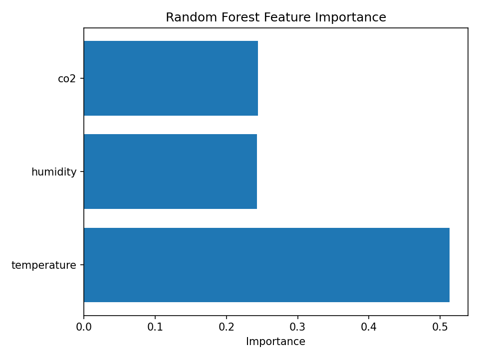
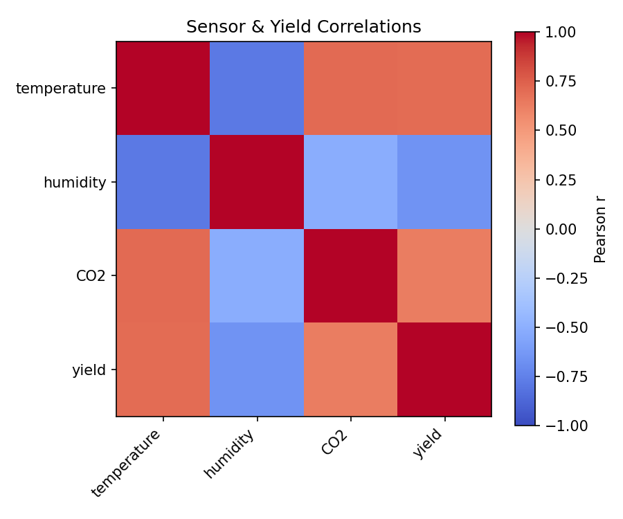
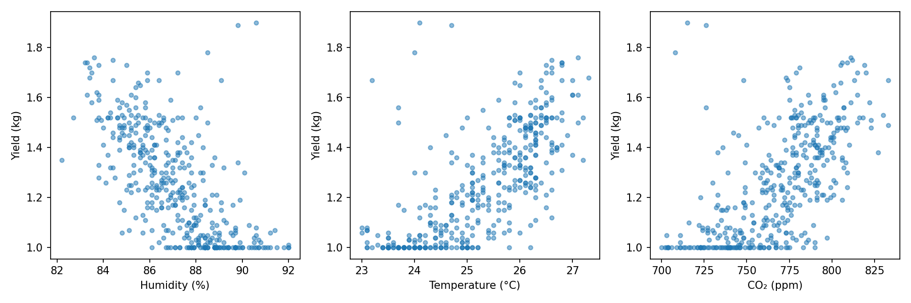

#  Mushroom Yield Forecast using Machine Learning


# Executive Summary

This project aims to predict the daily yield of oyster mushrooms using environmental sensor readings collected from a polyhouse. The machine learning model estimates mushroom yield based on three important parameters:

- Temperature (°C)
- Humidity (%)
- CO₂ concentration (ppm)

Several regression models were evaluated, including Linear Regression, Random Forest, and a Tuned Random Forest. After comparison, the Tuned Random Forest model achieved the best performance with:

- **MAE:** 0.081 kg
- **RMSE:** 0.111 kg
- **R² Score:** 0.737

The final model was deployed as an interactive Streamlit web application where users can input sensor values and instantly receive a yield prediction.

---

# 1. Problem Statement

Maintaining optimal environmental conditions inside a mushroom polyhouse is essential for maximizing production. Farmers often rely on experience to estimate future yield, making decision-making difficult.

The objective of this project is to build a machine learning model capable of accurately predicting mushroom yield using environmental sensor readings.

---

# 2. Dataset Description

The dataset contains historical polyhouse sensor measurements and corresponding mushroom yield.

### Features

| Feature | Description |
|---------|-------------|
| Temperature | Polyhouse temperature (°C) |
| Humidity | Relative humidity (%) |
| CO₂ | Carbon dioxide concentration (ppm) |

### Target

- Mushroom Yield (kg/day)

---

# 3. Data Cleaning

Several preprocessing steps were performed before model training.

### Cleaning Steps

- Removed duplicate records
- Checked missing values
- Verified data types
- Removed unnecessary columns
- Performed basic data validation
- Saved cleaned dataset

This ensured the model was trained using reliable and consistent data.

---

# 4. Exploratory Data Analysis (EDA)

Exploratory analysis was performed to understand relationships within the dataset.

### Visualizations

- Yield distribution
- Correlation heatmap
- Scatter plots
- Feature importance
- Predicted vs Actual graph
- Residual plots

### Observations

- Temperature showed the strongest influence on mushroom yield.
- Humidity and CO₂ also contributed to predictions.
- Relationships between variables were non-linear, making Random Forest a better choice than Linear Regression.

---

# 5. Feature Engineering & Validation Strategy

The selected features were:

- Temperature
- Humidity
- CO₂

The dataset was split into training and testing sets to evaluate model performance on unseen data.

Model validation was also performed using cross-validation to ensure the model generalized well.

Cross Validation Results:

- Random Forest CV MAE = **0.093 ± 0.031 kg**
- Linear Regression CV MAE = **0.102 ± 0.032 kg**

The Random Forest model consistently performed better across folds.

---

# 6. Models Evaluated

Three regression models were trained and compared.

| Model | MAE (kg) | RMSE (kg) | R² Score |
|------|---------:|----------:|----------:|
| Linear Regression | 0.090 | 0.120 | 0.696 |
| Random Forest | 0.090 | 0.120 | 0.707 |
| **Tuned Random Forest** | **0.081** | **0.111** | **0.737** |

---

# 7. Champion Model

The Tuned Random Forest model was selected because it produced:

- Lowest prediction error
- Highest R² score
- Better generalization
- More stable predictions

Performance:

- **MAE:** 0.081 kg
- **RMSE:** 0.111 kg
- **R²:** 0.737

---

# 8. Model Interpretation

Feature importance from the Random Forest model shows:

| Feature | Importance |
|----------|-----------:|
| Temperature | ~51% |
| Humidity | ~24% |
| CO₂ | ~25% |

Temperature is the most influential variable affecting mushroom yield.

---

# 9. Results

### Predicted vs Actual

The predicted values closely follow the ideal prediction line, indicating good predictive performance.

*(Insert Figure: reports/figures/pred_vs_actual.png)*

---

### Residual Analysis

Residual plots show that prediction errors are distributed around zero with no strong systematic pattern, indicating that the model fits the data reasonably well.

*(Insert Figure: reports/figures/residuals_linear.png)*

---

### Feature Importance

The feature importance graph demonstrates that temperature contributes the most to yield prediction.








---

# 10. Streamlit Deployment

An interactive Streamlit application was developed to allow users to predict mushroom yield.

### Features

- Temperature input
- Humidity input
- CO₂ input
- Instant prediction
- Prediction displayed in kilograms
- Feature contribution pie chart
- Sensitivity charts for all three sensors
- Input validation warnings
- Cached model loading for faster predictions

Deployment URL:

**https://zelbytes-yield-forecast-jgzip4ge3puipmrbv42mce.streamlit.app/**

---

# 11. Monitoring

Prediction logging has been implemented.

Each prediction stores:

- Timestamp
- Temperature
- Humidity
- CO₂
- Predicted Yield

Logs can later be used to:

- Detect data drift
- Compare predicted and actual yield
- Retrain the model when necessary

### Retraining Triggers

The model should be retrained when:

- MAE increases significantly
- Sensor calibration changes
- Seasonal growing conditions shift
- New historical data becomes available

---

# 12. Limitations

Current limitations include:

- Limited number of sensor features
- No seasonal information
- No mushroom growth stage information
- Predictions depend entirely on historical training data
- Small dataset compared to industrial production datasets

---

# 13. Future Work

Future improvements include:

- Collect larger datasets
- Include additional environmental sensors
- Add weather information
- Automate periodic retraining
- Deploy cloud-based monitoring dashboard
- Real-time IoT sensor integration
- Mobile application for farmers

---

# 14. Reproducibility

## Install dependencies

```bash
pip install -r requirements.txt
```

## Train Model

```bash
python src/random_forest.py
```

## Compare Models

```bash
python src/modelcomparison.py
```

## Run Prediction

```bash
python src/predict.py
```

## Launch Streamlit

```bash
streamlit run src/app.py
```

---

# Conclusion

This project successfully demonstrates how machine learning can be applied in precision agriculture to estimate mushroom yield using environmental sensor data. After comparing multiple regression models, the Tuned Random Forest achieved the best performance with an MAE of **0.081 kg**, RMSE of **0.111 kg**, and an R² score of **0.737**.

The final solution was deployed as an interactive Streamlit application, allowing users to obtain real-time yield predictions from sensor inputs. The system also includes monitoring through prediction logging, making it suitable for future model improvements and deployment in real-world farming environments.